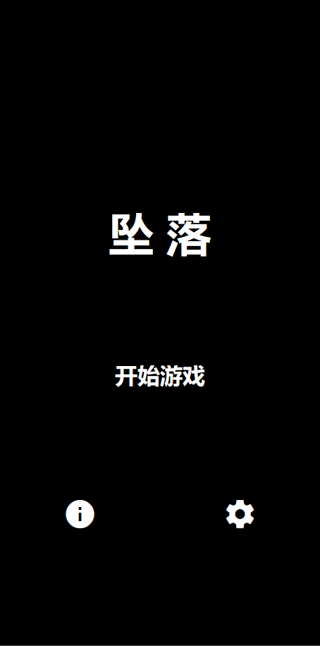
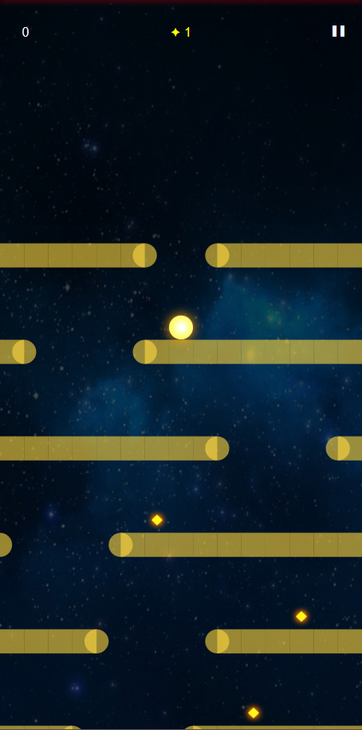
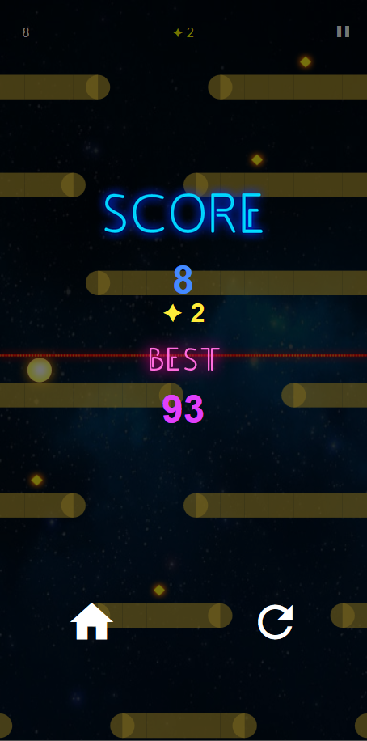

# 简介 

FallDown is a game developed using Flutter+Flame+Box2D.

坠落是使用[Flutter](https://flutter.dev/)+[Flame](https://flame-engine.org/)+[Box2D](https://flame-engine.org/docs/box2d.md)开发的一个开源小游戏。

我在[Wiiza](http://wiiza.com/)团队开发的[《FallDown delux》](https://play.google.com/store/apps/details?id=com.wiiza.falldown)的基础上将其移植到 Flutter 平台，并添加了重力感应特性。

# 预览

|   |    |
| :------------: | :------------: |
|   |    |


# 在线预览

网页版：http://v.idoo.top/web/fallDown

安卓版：[坠落.apk](release/坠落.apk)

# 开发

Web端生成
```shell
flutter build web --release
```

Android端生成
```shell
flutter build apk --release
```

PS：亦可支持iOS，Mac，Windows，Linux端，请自行打包

# 相关文章

[趣学 Flutter「小游戏」：坠落](https://juejin.cn/post/7082695284278427656)

# 免责声明

For learning purposes only. 

本游戏的创意玩法来自[《FallDown delux》](https://play.google.com/store/apps/details?id=com.wiiza.falldown)，应用内的素材收集自互联网，部分图片、音频素材版权归 Wiiza 团队所有，侵删。

# 鸣谢

Flutter https://flutter.dev/

Flame https://flame-engine.org/

Box2D https://flame-engine.org/docs/box2d.md

FallDown delux https://play.google.com/store/apps/details?id=com.wiiza.falldown
