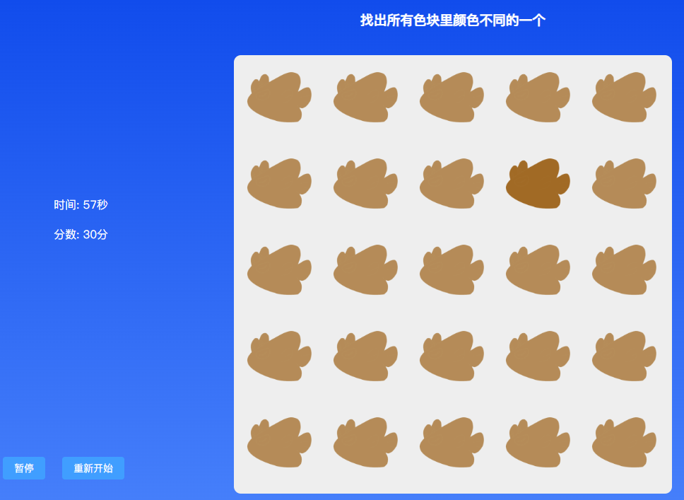
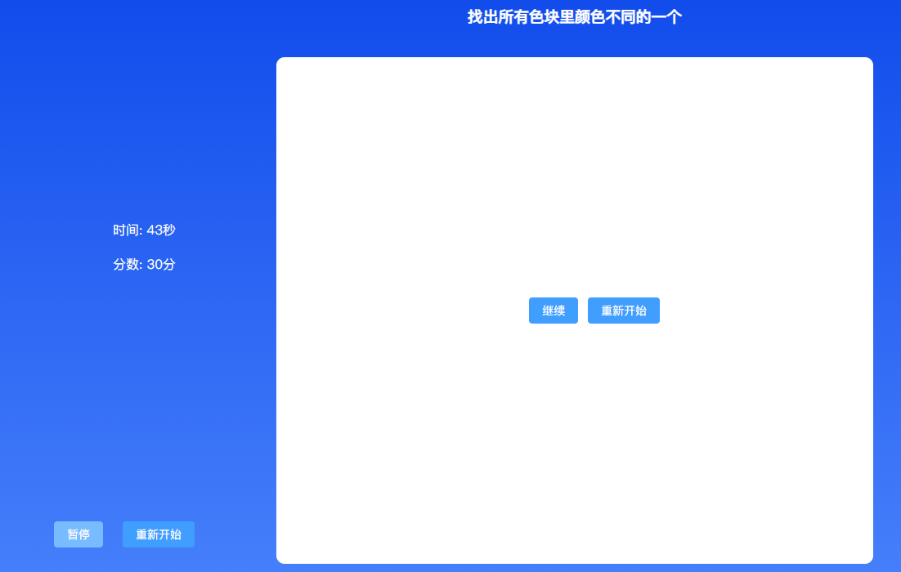
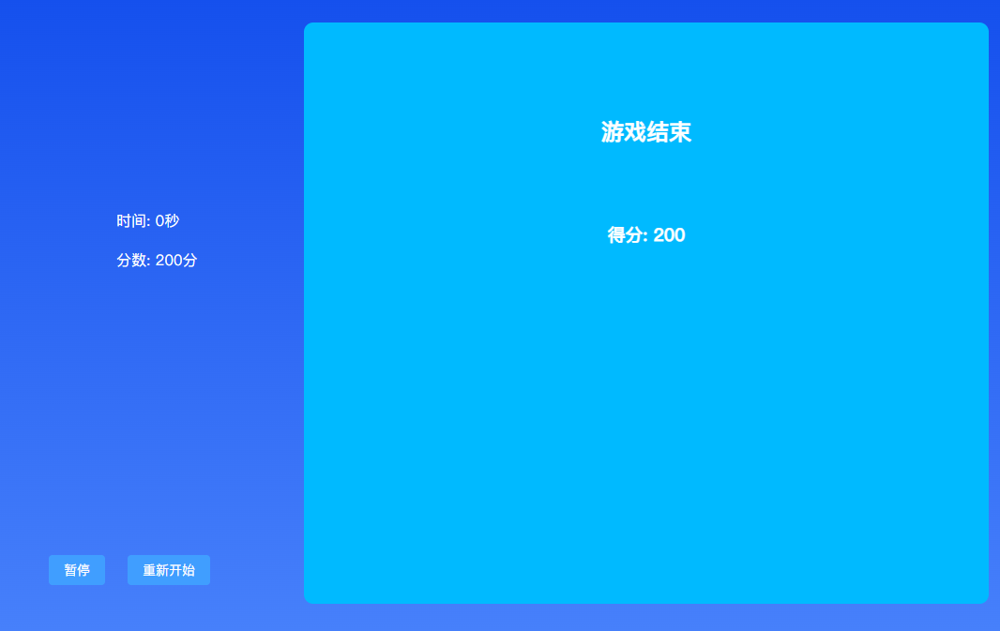

### 项目介绍：

这个游戏就是在1分钟内，找出不同颜色的yoyo，点击它之后，进入下一个环节

初始的时候，只有4个色块，随着游戏的深入，色块的行列都会增加，但是最大的色块会限制在100个；

采用的技术栈是vite+vue3+element plus

### 游戏地址：

https://642134542.github.io/find-color/dist/index.html

### 代码地址：

https://github.com/642134542/find-color

### 文章地址

https://juejin.cn/post/7086673557811363870

### 游戏界面
#### 开始

#### 游戏过程中

#### 暂停

#### 结束

