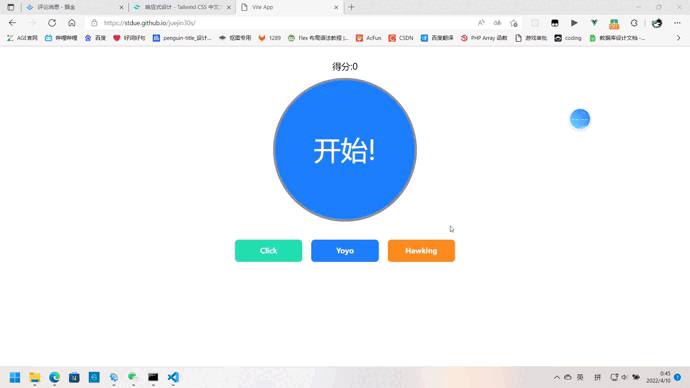

# 掘金30秒

## 项目介绍
这是一款使用vue+ts+tailWindCss+vite实现的一款原创小游戏，玩家需要在有限的时间内来点击按钮获取更多的分数，如果图片与按钮名称相符则正确，在场景中没有图片的情况下则判断场景颜色与按钮颜色是否相同，符号"!"为取反的意思，与图片一同显示则取反图片，单独显示则取反颜色，如果选错3次直接游戏结束

## 快速体验
快速体验网址：https://stdue.github.io/juejin30s/



## 本地搭建
1. 克隆项目
```shell
git clone https://github.com/stdue/juejin30s.git
```
2. 安装依赖
```shell
npm i
```
3. 启动项目
```shell
npm run dev
```

## 项目实现思路以及细节

点击这里 [想玩一点又动脑子又拼手速的小游戏？来试试这款掘金30秒！](https://juejin.cn/post/7084585998947975181)

