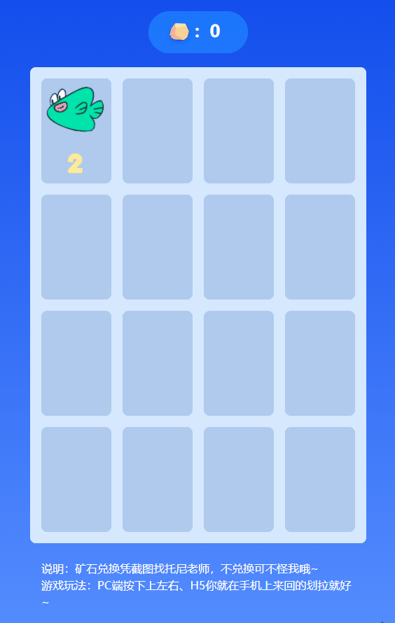

# juejin-2048

## 项目介绍

这是一款以2048为原型使用Vue3+TS+Vite+TailwindCSS实现2048小游戏；2048这款游戏相信大家已经不陌生了，这款游戏最早发布于2014年，玩法也比较简单，就是通过方向键去滑动页面，然后页面中的数字向指定方向靠拢，如果数字相同则进行数字合并。

## 快速体验

### GitHub page

可以在线体验这款小游戏，体验地址[掘金牌2048](https://ywanzhou.github.io/juejin-2048/)



### 本地搭建

1. 克隆项目
  ```shell
  git clone https://github.com/ywanzhou/juejin-2048.git
  ```
2. 安装依赖
  ```shell
  npm i 
  # 或者 
  yarn
  ```
3. 启动项目
  ```shell
  npm run dev
  # 或者
  yarn dev
  ```
4. 局域网访问
  ```shell
  npx vite --host
  # 或者
  yarn vite --host
  ```

## 项目实现思路以及细节

点击链接查看👉[怎么才能快速获取矿石，快来【掘金牌2048】吧](https://juejin.cn/post/7080899111188332575)


## License

Game-Garden is under the MIT license.