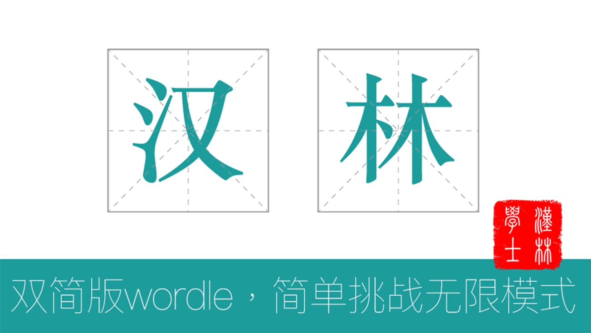

# 汉林
> 挑战你的成语储备，缔造汉字的翰林成就。

## 项目简介
汉林，双简版wordle，简单版汉兜(简体中文&简单化)。
简单版本，不止是实现的简单，还有玩起来也简单。
***我们有一些和汉兜不一样的实现：随机词库的无限模式。***

## 快速体验
体验地址：[wordle.lovetime.top](http://wordle.lovetime.top/)

## 项目实践细节

[汉林：使用uniapp来实现wordle，来看看成语你能猜对几分](https://juejin.cn/post/7087892845998604319)